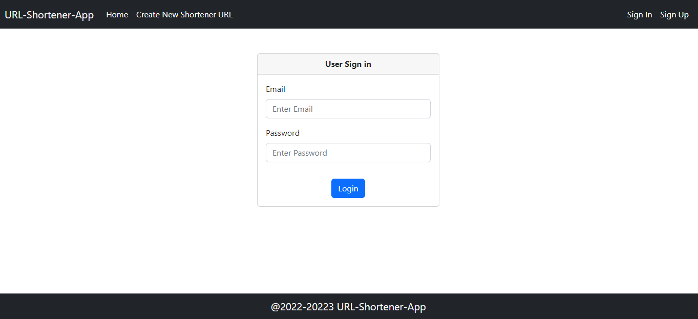
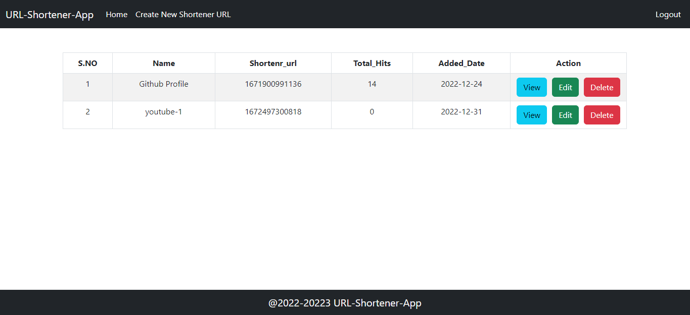
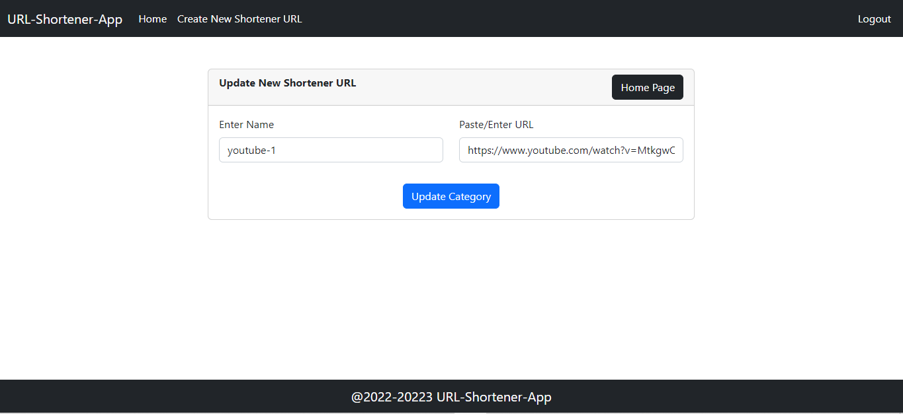
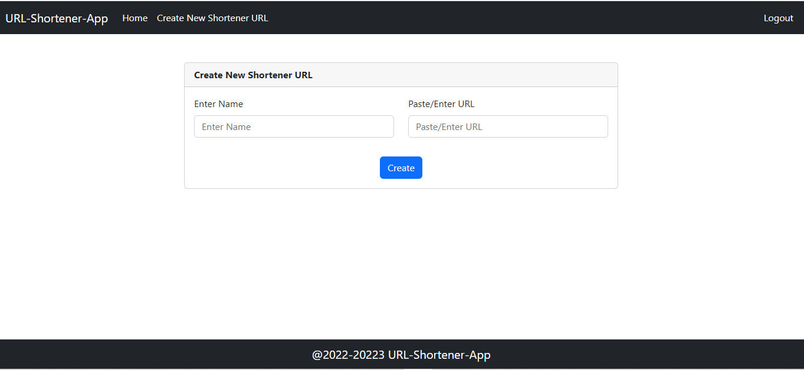

# URL Shortener using React and Node

## `How to install`

git clone https://github.com/iamRajatSharma/URL-Shortener.git  
cd ./URL-Shortener 

### `Start Frontend`
npm install 
npm start 

### `Start Backend`
cd ./backend/  
npm install 
npm start 

Runs the app in the development mode. 
Open http://localhost:3000 to view it in your browser. 

The page will reload when you make changes. 
You may also see any lint errors in the console. 

### `Demo 1`

### `Demo 2`

### `Demo 3`

### `Demo 4`
